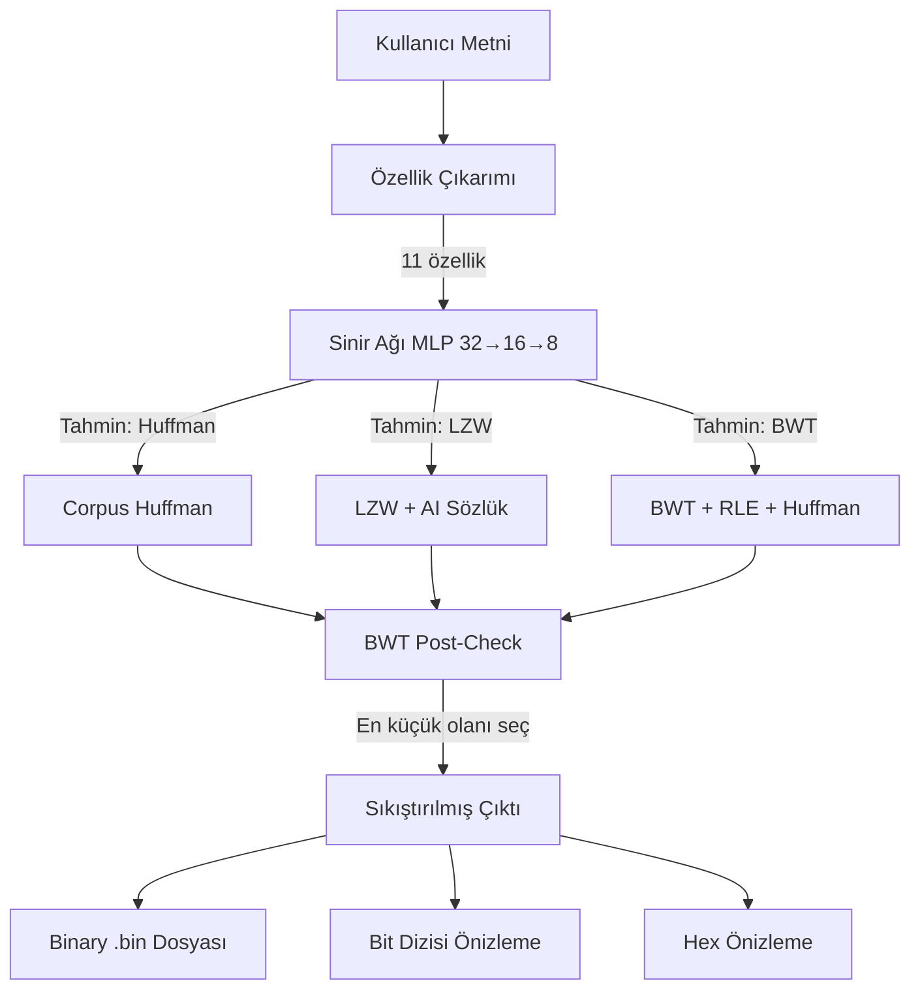
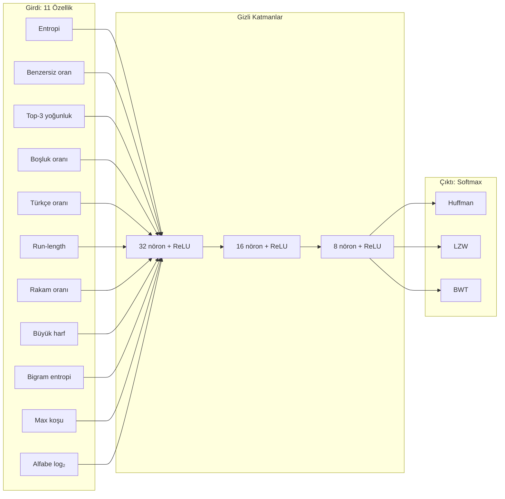
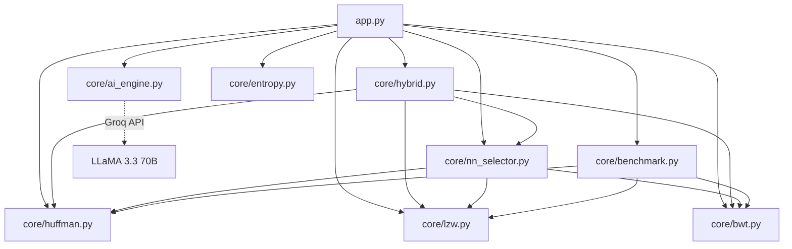
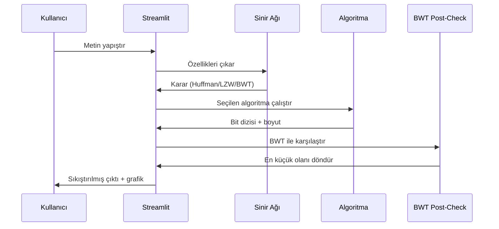

#  Sistem Mimarisi Diyagramları

## 1. Genel Sistem Akışı

## 2. Sinir Ağı Mimarisi

## 3. BWT + RLE + Huffman Pipeline (bzip2 tekniği)

```mermaid
flowchart LR
    A[Orijinal Metin] -->|"Tüm permütasyonlar"| B[Suffix Array Sıralama]
    B --> C[BWT: son sütun + orig_idx]
    C -->|"Benzer karakterler kümelendi"| D[RLE: ch,count çiftleri]
    D --> E[Huffman Kodlama]
    E --> F[Sıkıştırılmış Bit Dizisi]

    F -.->|Decode için| G[BWT decode]
    G -->|LF Mapping| H[Orijinal Metin]
```

## 4. Modül Bağımlılıkları

## 5. Veri Akışı (Encode/Decode)

---

**Mermaid kullanımı:** Bu diyagramlar GitHub'da otomatik render olur.
Yerel görmek için VS Code'da "Markdown Preview Mermaid Support" eklentisi kur.
