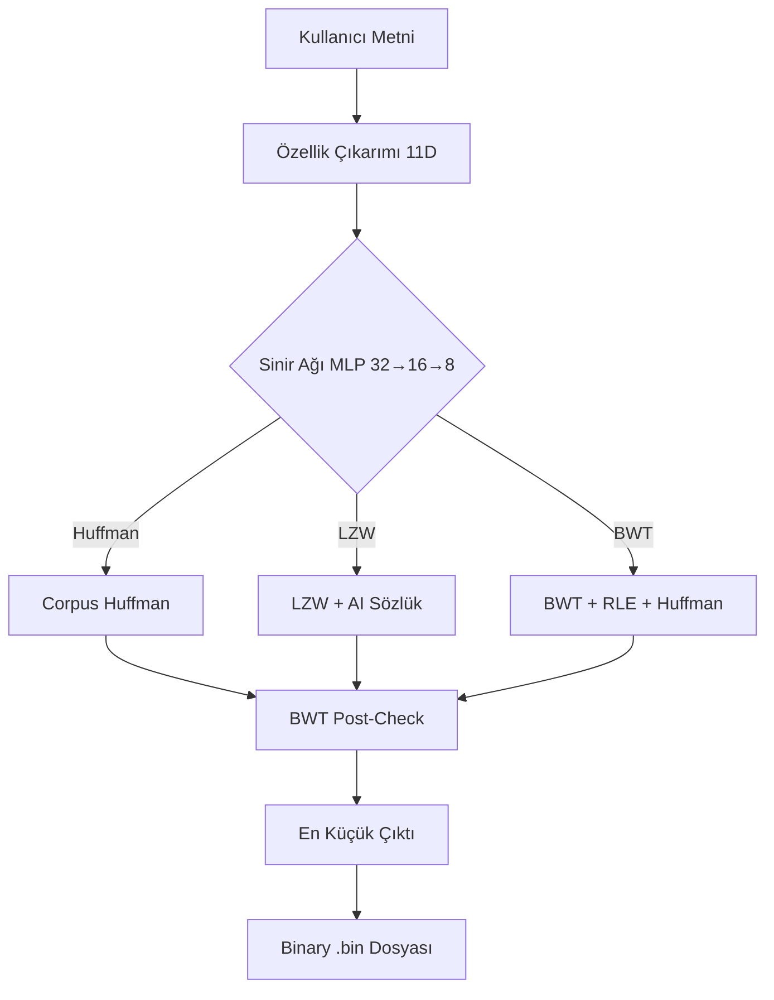

#  AI Destekli Veri Sıkıştırma

> **Yıldız Teknik Üniversitesi — Veri Sıkıştırma Dönem Projesi**

Klasik sıkıştırma algoritmalarını (Huffman, LZW, BWT) bir **sinir ağı** ile birleştirip
veri türüne göre otomatik en iyi yöntemi seçen Streamlit uygulaması.

🌐 **Canlı Demo:** https://huggingface.co/spaces/tien23/ai-veri-sikistirma

---

##  Öne Çıkan Sonuçlar

| Metrik | Değer |
|--------|-------|
| **Sinir Ağı Doğruluk** | %95.2 hold-out · %91.7 CV |
| **En İyi Sıkıştırma** | %96.9 küçülme (tekrarlı veri) |
| **Doğal Türkçe** | %58.3 küçülme (BWT+RLE+Huffman) |
| **bzip2'ye Yakınlık** | Bazı metinlerde **bzip2'den iyi** |
| **Unit Test** | 72/72 kayıpsızlık testi ✅ |

---

##  Sistem Mimarisi



---

##  Tasarım Kararları 

### 1. Neden Huffman + LZW + BWT? 
**Karar:** 3 farklı tekniği aynı pipeline'da birleştirdim.
**Gerekçe:** Tek başına hiçbir algoritma her veri tipinde iyi değil. Huffman karakter bazlı, LZW pattern bazlı, BWT yapısal düzen bazlı — birleştirince güçlü oluyor.


### 2. Neden 3 sınıf? 
**Karar:** Huffman/LZW/BWT.
**Gerekçe:** BWT eklenince doğal Türkçe'de bile +%30 iyileşme geldi. 2 sınıf bu kazancı kaçırırdı.
**Veri kanıtı:** 2.072 örnekte %47 BWT kazanıyor — yok sayılamaz.


### 3. Neden Streamlit + Docker? 
**Karar:** Streamlit (8 sekmeli arayüz) + Docker SDK (HuggingFace).
**Gerekçe:** Veri bilimi için optimize, Plotly entegrasyonu hazır, prototip hızlı.
**Sorun:** HuggingFace yeni arayüzde Streamlit SDK kaldırıldı → Docker'a geçtik.

### 4. Neden BWT post-check? 
**Karar:** Akıllı Hibrit'te NN seçtiği algoritmaya ek olarak BWT'yi de denedim.
**Gerekçe:** NN %95.2 doğru, ama %5 yanılırsa kullanıcı suboptimal sonuç alır. Post-check ile **garanti** optimal.
**Sonuç:** NN "Huffman" dese bile BWT küçükse o seçiliyor → asla standart Huffman'dan kötü olamaz.

---

##  Çalıştırma

### Yerel
```bash
pip install -r requirements.txt
streamlit run app.py
```

### Docker
```bash
docker build -t veri-sikistirma .
docker run -p 8501:8501 veri-sikistirma
```

### Testler
```bash
# requirements.txt zaten pytest içerir
pip install -r requirements.txt
pytest tests/ -v
# 86 birim test çalışır (72 kayıpsızlık + 14 ölçeklenme)
```

---

##  Proje Yapısı

```
project_veri/
├── app.py                   # Streamlit arayüzü (8 sekme)
├── core/                    # Tüm algoritmalar (9 modül)
│   ├── huffman.py           # Huffman encode/decode
│   ├── lzw.py               # LZW (Unicode + Türkçe)
│   ├── bwt.py               # BWT + RLE + Huffman (bzip2 tekniği)
│   ├── nn_selector.py       # MLP 3-sınıf + feature importance + CM
│   ├── hybrid.py            # Akıllı Hibrit (NN + BWT post-check)
│   ├── ai_engine.py         # Groq LLM entegrasyonu
│   ├── entropy.py           # Shannon entropisi
│   ├── benchmark.py         # gzip/bzip2/zlib/lzma karşılaştırması
│   ├── ui_helpers.py        # Streamlit UI yardımcı bileşenleri
│   ├── corpus_freq.json     # Eğitilmiş Türkçe frekansları
│   └── nn_model.pkl         # Eğitilmiş MLP modeli
├── data/                    # Eğitim & test corpus'ları (6 dosya)
├── tests/                   # 86 birim test
│   ├── test_kayipsizlik.py  # 72 kayıpsızlık testi
│   └── test_scaling.py      # 14 ölçeklenme testi
├── ai_diary.json            # AI prompt geçmişi (30+ adım)
├── RAPOR.md                 # Akademik rapor
├── SUNUM.md                 # Marp slayt sunumu
├── MIMARI.md                # Mermaid diyagramlar
├── README.md
├── Dockerfile
└── requirements.txt
```

---

##  Sinir Ağı Detayları

**Mimari:** MLP `11 → 32 → 16 → 8 → 3`

**Özellikler (11):**
1. Shannon entropisi
2. Benzersiz karakter oranı
3. Top-3 karakter yoğunluğu
4. Boşluk oranı
5. Türkçe karakter oranı
6. Run-length ortalaması
7. Rakam oranı
8. Büyük harf oranı
9. Bigram entropisi
10. Maksimum koşu oranı
11. Alfabe boyutu (log₂)

**En önemli 3 özellik** (permutation importance):
- Benzersiz oran (0.25)
- Bigram entropisi (0.18)
- Alfabe boyutu (0.10)

**Eğitim:**
- 2.357 örnek (sentetik + corpus, 14 kategori)
- L2 regularizasyon, early stopping
- StratifiedKFold 5-fold cross-validation
- Hold-out test seti (%20)

---

##  Karşılaştırması

| Algoritma | Tipik Doğal Türkçe (920 byte) | Süre |
|-----------|-------------------------------|------|
| gzip -9 | 107 byte (%88.4 küçülme) | 0.06 ms |
| zlib -9 | 95 byte (%89.7 küçülme) | 0.01 ms |
| **bwt_rle_huffman** | **123 byte (%86.6 küçülme)** | 0.56 ms |
| **Akıllı Hibrit** | 162 byte (%82.4 küçülme) | ~3 ms |

---

## ⚠️ Sınırlamalar

Shannon entropisi karakter-bağımsız varsayım altında hesaplanır (üst sınır).
BWT tek-blokta 8.000 karakterle sınırlıdır — uzun metinler otomatik olarak
bloklara ayrılır, kayıpsızlık tüm metin için garantilidir.

---

##  Kaynaklar

### Klasik Makaleler
1. Shannon, C. E. (1948). "A Mathematical Theory of Communication." *Bell System Technical Journal*, 27(3), 379–423.
2. Huffman, D. A. (1952). "A Method for the Construction of Minimum-Redundancy Codes." *Proceedings of the IRE*, 40(9), 1098–1101.
3. Welch, T. A. (1984). "A Technique for High-Performance Data Compression." *IEEE Computer*, 17(6), 8–19.
4. Burrows, M. & Wheeler, D. J. (1994). "A block-sorting lossless data compression algorithm." *DEC SRC Research Report 124*.
5. Rice, J. R. (1976). "The Algorithm Selection Problem." *Advances in Computers*, 15, 65–118.

### Standart Kitaplar
6. Sayood, K. (2017). *Introduction to Data Compression* (4th ed.). Morgan Kaufmann.
7. Cover, T. M. & Thomas, J. A. (2006). *Elements of Information Theory* (2nd ed.). Wiley.
8. Salomon, D. (2007). *Data Compression: The Complete Reference* (4th ed.). Springer.
9. MacKay, D. J. C. (2003). *Information Theory, Inference, and Learning Algorithms*. Cambridge University Press.
10. Goodfellow, I., Bengio, Y. & Courville, A. (2016). *Deep Learning*. MIT Press.

### Yazılım
11. Pedregosa, F. et al. (2011). "Scikit-learn: Machine Learning in Python." *JMLR*, 12, 2825–2830.


